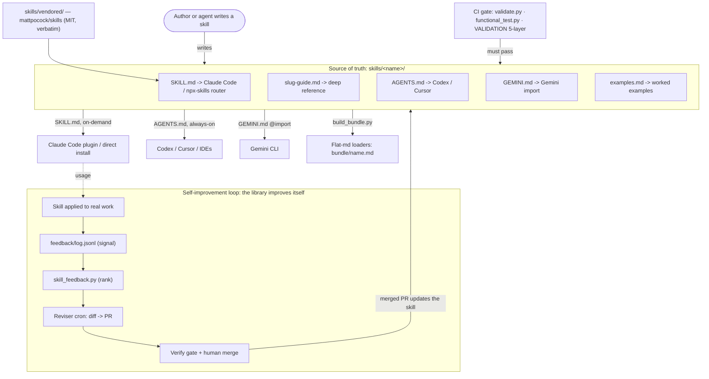

# Arete

[](https://github.com/sanjeevrg89/arete/actions/workflows/ci.yml)

**Distinguished-engineer skills for Kubernetes, GKE, and the ML-infrastructure stack — installable in
one command, in any agent.**

Most agent-skill collections teach an agent *how to work* (plan, test, review). Arete teaches it *what
a staff/principal practitioner knows*: how to debug a CrashLoopBackOff, why one GPU straggler makes
every rank's nvidia-smi read ~100%, how to size a Kueue quota, when `memory limit == request` matters.
Process skills and domain depth are complements — Arete ships both.

- **59 first-party domain skills** — Go, Kubernetes (use / controller / operator / internals), GKE, and
  the ML-infra stack (Kueue, JobSet/LWS, training & serving frameworks, Ray, Slurm/HPC, autoscaling,
  ML data / evals / governance).
- **25 vendored process skills** from [mattpocock/skills](https://github.com/mattpocock/skills) (MIT) —
  grilling, spec/ticket flows, TDD, code review, bug diagnosis ([notices](THIRD-PARTY-NOTICES.md)).
- **84 total**, from **one source of truth per skill**, gated by CI, and sharpened by a feedback loop
  instead of going stale.

**[→ Get 10–100x out of it](USAGE.md)** · **[Browse every skill](REGISTRY.md)** · **[Add one](SKILL-AUTHORING-SPEC.md)** · **[Contributing](CONTRIBUTING.md)**

## Install (~30 seconds)

Pick one channel — installing several duplicates skills.

**Claude Code** — as a plugin (managed bundle, updates when we ship):

```
/plugin marketplace add sanjeevrg89/arete
/plugin install arete@arete
```

**Codex, Cursor, Gemini CLI, and 40+ other agents** — via [skills.sh](https://skills.sh):

```bash
npx skills add sanjeevrg89/arete        # pick skills interactively
npx skills add sanjeevrg89/arete --all  # or everything, everywhere
```

**Clone + script** (tinkerers — you own the files):

```bash
git clone https://github.com/sanjeevrg89/arete.git && cd arete

./install.sh list                   # list all 84 skills
./install.sh claude                 # symlink every skill into ~/.claude/skills (load on demand)
./install.sh flat ~/.gemini/skills  # flat self-contained <name>.md files for markdown loaders
./update.sh                         # later: pull + refresh your installs in one step
```

Then just work — relevant skills load by themselves. New here? Read **[USAGE.md](USAGE.md)** first.

## Why Arete

- **Works in any agent.** One source of truth → `SKILL.md` (Claude Code / agentskills.io standard),
  `AGENTS.md` (Codex / Cursor / IDEs), `GEMINI.md` (Gemini CLI), plus a flat bundle for any markdown
  loader. Switch tools, keep the expertise.
- **Router-grade descriptions.** Every skill's frontmatter enumerates trigger symptoms *and*
  non-goals ("NOT for control-plane internals"), so models route to the right skill instead of guessing.
- **Held to a distinguished bar.** Guides are written at a staff/principal practitioner's level with a
  verification gate and a 5-layer validation harness (green CI ≠ validated — see
  [`tests/VALIDATION.md`](tests/VALIDATION.md)).
- **Gets sharper from use.** A feedback loop ([`feedback/`](feedback/README.md) → reviser → PR, behind a
  verify gate) improves skills from real usage — the [`skill-self-improvement`](skill-self-improvement/)
  pattern.

## Layout

```
skills/
  <name>/                     # first-party skill = source of truth
    SKILL.md                  #   router (frontmatter name + description) + essentials
    <name>-guide.md           #   the deep reference
    AGENTS.md                 #   always-on condensed ruleset (Codex/Cursor)
    GEMINI.md                 #   @-imports the guide (Gemini CLI)
    examples.md               #   worked manifests/examples
  vendored/mattpocock/<name>/ # third-party skills, verbatim, MIT (see THIRD-PARTY-NOTICES.md)
bundle/<name>.md              # generated flat self-contained copies (build_bundle.py)
scripts/, tests/, feedback/   # validation harness, functional checks, self-improvement signal
```

| File | Consumed by | Role |
|------|-------------|------|
| `SKILL.md` | Claude Code & any agentskills.io loader | Frontmatter (`name` + router `description`) + essentials; loads on demand. |
| `<slug>-guide.md` | everything | The full deep reference (single source of truth). |
| `AGENTS.md` | Codex / Cursor / agentic IDEs | Always-on condensed summary + pointer to the guide. |
| `GEMINI.md` | Gemini CLI | Imports the guide via `@./<slug>-guide.md`. |
| `examples.md` | everything | Canonical worked examples / manifests (most skills). |

First-party skills follow the house spec (`SKILL.md` + guide + `AGENTS.md` + `GEMINI.md`, validated in
CI); vendored skills stay verbatim at their upstream layout and are validated loosely so upstream syncs
stay clean.

## Architecture

One source of truth per skill → consumed by many channels, gated by CI, improved by a feedback loop:



## Testing skill routing

[`tests/skill-routing-checklist.md`](tests/skill-routing-checklist.md) has one discriminating prompt
per skill with the skill it should route to — use it to confirm each skill installs and routes
correctly in Claude Code (`/skills` should list every skill).

**Functional checks** (`tests/functional/checks.json` + `scripts/functional_test.py`) go beyond routing:
each is "given this prompt, the output must satisfy X" (regex assertions). CI lints the specs
(`functional_test.py --lint`); to actually run them against an agent: `AGENT_CMD='claude -p' python
scripts/functional_test.py`.

**Validating a skill for real** — structure/routing/functional checks are necessary but not sufficient;
real confidence comes from applying a skill to an actual repo/task and judging the output against an
expert bar. See [`tests/VALIDATION.md`](tests/VALIDATION.md) for the 5-layer procedure (incl. A/B vs a
no-skill baseline and a content-accuracy pass) and record results in
[`tests/validation-log.md`](tests/validation-log.md). Green CI ≠ validated.

## Validation / CI

`scripts/validate.py` (stdlib only) checks every skill: valid `SKILL.md` frontmatter, `name` matches
the directory and is unique (across first-party *and* vendored), a router-grade `description`, the
required house files for first-party skills (`SKILL.md` / guide / `AGENTS.md` / `GEMINI.md`), resolvable
`[[cross-links]]`, and no vendor-locked framing or co-author trailers. Run it locally with
`python scripts/validate.py`; `.github/workflows/ci.yml` runs it on every push and PR. Errors fail the
build; warnings don't.

## Self-improvement loop (the library improving itself)

The library doesn't just get edited by hand — it has a loop that improves skills from real-world
feedback. The [`skill-self-improvement`](skill-self-improvement/) skill is the pattern; the repo ships
the substrate:

- **Signal** — append a record to [`feedback/log.jsonl`](feedback/README.md) when a skill underperforms
  (what skill, what was wrong, the correct answer). Failing functional checks are signal too.
- **Rank** — `python scripts/skill_feedback.py` lists the skills with the most negative signal (the
  improvement candidates); `--lint` validates the records in CI.
- **Reviser** — [`.github/workflows/skill-self-improvement.yml`](.github/workflows/skill-self-improvement.yml)
  runs on a weekly cron. The committed job is **dry-run** (lints the signal + prints candidates, no
  secrets, writes nothing); the real reviser step — an agent that diffs an underperforming skill's guide,
  adds a regression check, and **opens a PR** — is documented there, gated, and **never auto-merges**.
- **Gate & distill** — the PR passes the same `validate.py` + functional checks (`ci.yml`) plus review,
  then the lesson is distilled into the guide's anti-patterns + a `must_*` check so it can't regress.

This is `tests/VALIDATION.md` Layer 5 step 4 ("feed failures back"), automated.

## Design notes

- **On-demand loading is what makes a large library viable.** Agents discover skills by their
  `description` and load only what's relevant — never all guides at once. Keep `AGENTS.md`/`GEMINI.md`
  small (they're always-on); the depth lives in the guide.
- **One source of truth per skill:** the `<slug>-guide.md`. The entry files defer to it.
- **Vendored skills stay verbatim** so they can be synced from upstream deliberately (see
  [`THIRD-PARTY-NOTICES.md`](THIRD-PARTY-NOTICES.md)); where a vendored process skill overlaps a
  first-party one, both descriptions are scoped so routing stays unambiguous.
- The ecosystem (K8s, GKE, ML/serving/training frameworks) moves fast — guides flag version-sensitive
  details and tell the reader to verify against current upstream docs.

## License

Apache-2.0 for first-party content; vendored skills keep their upstream licenses — see
[`THIRD-PARTY-NOTICES.md`](THIRD-PARTY-NOTICES.md).
