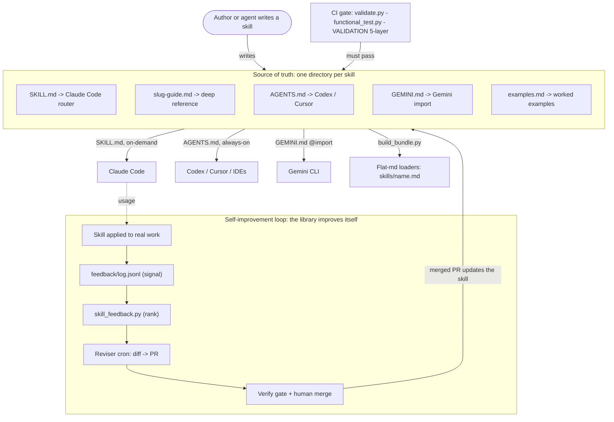

# Arete

[](https://github.com/sanjeevrg89/arete/actions/workflows/ci.yml)

**A self-improving skill library that works in Claude Code, Codex, and Gemini CLI — and gets sharper
every time you use it.**

Arete is **59 distinguished-engineer skills** — Go, Kubernetes (use/control/operator/internals), and the
ML-infra stack (Kueue, JobSet/LWS, training & serving frameworks, Slurm/HPC, GKE, autoscaling) plus the
engineering craft around them — shipped from **one source of truth** into every agent, and wired with a
feedback loop so they sharpen from real use instead of going stale.

**[→ Get 10–100x out of it](USAGE.md)** · **[Browse every skill](REGISTRY.md)** · **[Add one](SKILL-AUTHORING-SPEC.md)** · **[Contributing](CONTRIBUTING.md)**

## Quickstart (any agent, ~2 minutes)

```bash
git clone git@github.com:sanjeevrg89/arete.git && cd arete

./install.sh claude                 # Claude Code: symlink every skill into ~/.claude/skills (load on demand)
./install.sh flat ~/.gemini/skills  # Gemini CLI / any markdown loader: the flat <name>.md bundle
# Codex / Cursor / IDEs: drop a skill's AGENTS.md + guide into your repo (or reference it from AGENTS.md)
```

Then just work — relevant skills load by themselves. New here? Read **[USAGE.md](USAGE.md)** first.

## Why Arete

- **Works in any agent.** One source of truth → `SKILL.md` (Claude Code), `AGENTS.md` (Codex / IDEs),
  `GEMINI.md` (Gemini CLI), and a flat bundle for any markdown loader. Switch tools, keep the expertise.
- **Gets sharper from use.** A feedback loop ([`feedback/`](feedback/README.md) → reviser → PR, behind a
  verify gate) improves the skills from real usage — the [`skill-self-improvement`](skill-self-improvement/) pattern.
- **Held to a distinguished bar.** Every guide is written at a staff/principal practitioner's level, with
  a verification gate and a 5-layer validation harness (green CI ≠ validated — see [`tests/VALIDATION.md`](tests/VALIDATION.md)).

## Architecture

How the repo works: **one source of truth per skill** → consumed by many agents, gated by CI, and
improved by a feedback loop. The diagram below renders inline on GitHub; an **editable
[Excalidraw version is here](https://excalidraw.com/#json=GfOHF9IXI3Njzr2PbvMTF,RtD7am1R9kr-tiTLmY3vFw)**
(open it, then *Export → PNG* into `docs/` if you want to embed the hand-drawn version inline).



Install/update wires the source into each agent (`install.sh` symlinks for Claude Code; flat copies for
markdown loaders). The loop is documented in [`skill-self-improvement`](skill-self-improvement/).

## What each skill directory contains
| File | Consumed by | Role |
|------|-------------|------|
| `SKILL.md` | Claude Code | Frontmatter (`name` + router `description`) + essentials; loads on demand. |
| `<slug>-guide.md` | everything | The full deep reference (single source of truth). |
| `AGENTS.md` | Codex / Cursor / agentic IDEs (AGENTS.md standard) | Always-on condensed summary + pointer to the guide. |
| `GEMINI.md` | Gemini CLI | Imports the guide via `@./<slug>-guide.md`. |
| `examples.md` | everything | Canonical worked examples / manifests (most skills). |

## Install

### Quick start (clone + `install.sh`)
The repo is private — clone with your GitHub auth (SSH key or `gh auth login` / a PAT over HTTPS):
```bash
git clone git@github.com:sanjeevrg89/arete.git
cd arete

./install.sh list                 # list the skills
./install.sh claude               # symlink all skills into ~/.claude/skills (Claude Code)
./install.sh flat ~/.gemini/skills  # copy the flat <name>.md bundle for a markdown-file loader
./install.sh help
```
`install.sh flat <dest>` regenerates the flat bundle and copies it to whatever directory your loader
scans (set `<dest>` to your tool's skills path). Manual equivalents below.

### Updating
One command — pulls latest and refreshes your install:
```bash
cd arete
./update.sh                 # git pull + refresh Claude Code install (~/.claude/skills)
./update.sh ~/.gemini/<codename>/skills   # ...also refresh a flat-bundle copy at that path
```
Under the hood: **symlink (Claude) installs** just need a re-link to pick up newly added skills;
**flat installs are copies** and get re-copied. `update.sh` does the right thing for both (manual
equivalent: `git pull` then re-run `./install.sh ...`).

### Claude Code (skills load on demand — all of them can coexist)
```bash
mkdir -p ~/.claude/skills
for d in ~/Documents/arete/*/; do
  [ -f "$d/SKILL.md" ] && ln -sfn "$d" ~/.claude/skills/"$(basename "$d")"
done
```

### Gemini CLI (per project or global)
Gemini loads one `GEMINI.md` from the working dir / config dir. Copy the skill(s) relevant to a repo:
```bash
cp -R ~/Documents/arete/gke-master ./            # then GEMINI.md imports the guide
# or globally:  cp -R ~/Documents/arete/<skill> ~/.gemini/
```

### AGENTS.md-compatible agents / agentic IDEs (e.g. Antigravity, Codex, Cursor)
Drop the relevant skill's `AGENTS.md` + guide into the repo root, or reference the guide from your
existing `AGENTS.md`. The content is vendor-neutral Markdown, so it ports to any "custom rules" surface.

## Two consumable layouts
This repo ships skills in **two forms** so it works with any loader:

1. **Directory-per-skill** (source of truth) — `<name>/SKILL.md` + `<name>/<name>-guide.md` +
   `AGENTS.md` + `GEMINI.md` + `examples.md`. Best for Claude Code (`SKILL.md` discovery) and tools
   that read a skill folder.
2. **Flat self-contained bundle** — `skills/<name>.md`, one file per skill with the frontmatter, the
   **full guide, and examples inlined**. Best for loaders that read **markdown files from a `skills/`
   directory** (the deep content travels in the file, not a separate guide). Regenerate with
   `python scripts/build_bundle.py` after editing any skill.

Point a flat-markdown loader at the `skills/` directory; point a folder-based/Claude loader at the
repo root (skill directories).

## Testing skill routing
[`tests/skill-routing-checklist.md`](tests/skill-routing-checklist.md) has one discriminating prompt
per skill (46) with the skill it should route to — use it to confirm each skill installs and routes
correctly in Claude Code (`/skills` should list every skill).

**Functional checks** (`tests/functional/checks.json` + `scripts/functional_test.py`) go beyond routing:
each is "given this prompt, the output must satisfy X" (regex assertions). CI lints the specs
(`functional_test.py --lint`); to actually run them against an agent: `AGENT_CMD='claude -p' python
scripts/functional_test.py`.

**Validating a skill for real** — structure/routing/functional checks are necessary but not sufficient;
real confidence comes from applying a skill to an actual repo/task and judging the output against an
expert bar. See [`tests/VALIDATION.md`](tests/VALIDATION.md) for the 5-layer procedure (incl. A/B vs a
no-skill baseline and a content-accuracy pass) and record results in
[`tests/validation-log.md`](tests/validation-log.md). Green CI ≠ validated.

## Validation / CI
`scripts/validate.py` (stdlib only) checks every skill: valid `SKILL.md` frontmatter, `name` matches
the directory and is unique, a router-grade `description`, the required files (`SKILL.md` / guide /
`AGENTS.md` / `GEMINI.md`), resolvable `[[cross-links]]`, and no vendor-locked framing or co-author
trailers. Run it locally with `python scripts/validate.py`; `.github/workflows/ci.yml` runs it on every
push and PR. Errors fail the build; warnings don't.

## Self-improvement loop (the library improving itself)

The library doesn't just get edited by hand — it has a loop that improves skills from real-world
feedback. The [`skill-self-improvement`](skill-self-improvement/) skill is the pattern; the repo ships
the substrate:

- **Signal** — append a record to [`feedback/log.jsonl`](feedback/README.md) when a skill underperforms
  (what skill, what was wrong, the correct answer). Failing functional checks are signal too.
- **Rank** — `python scripts/skill_feedback.py` lists the skills with the most negative signal (the
  improvement candidates); `--lint` validates the records in CI.
- **Reviser** — [`.github/workflows/skill-self-improvement.yml`](.github/workflows/skill-self-improvement.yml)
  runs on a weekly cron. The committed job is **dry-run** (lints the signal + prints candidates, no
  secrets, writes nothing); the real reviser step — an agent that diffs an underperforming skill's guide,
  adds a regression check, and **opens a PR** — is documented there, gated, and **never auto-merges**.
- **Gate & distill** — the PR passes the same `validate.py` + functional checks (`ci.yml`) plus review,
  then the lesson is distilled into the guide's anti-patterns + a `must_*` check so it can't regress.

This is `tests/VALIDATION.md` Layer 5 step 4 ("feed failures back"), automated.

## Design notes
- **On-demand loading is what makes a large library viable.** Claude Code discovers skills by their
  `description` and loads only what's relevant — never all guides at once. Keep `AGENTS.md`/`GEMINI.md`
  small (they're always-on); the depth lives in the guide.
- **One source of truth per skill:** the `<slug>-guide.md`. The entry files defer to it.
- The ecosystem (K8s, GKE, ML/serving/training frameworks) moves fast — guides flag version-sensitive
  details and tell the reader to verify against current upstream docs.
